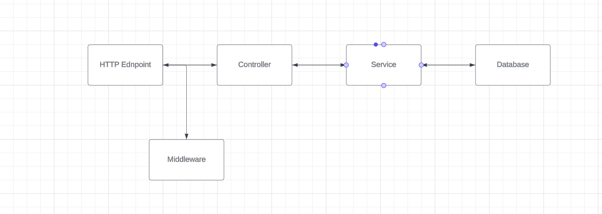
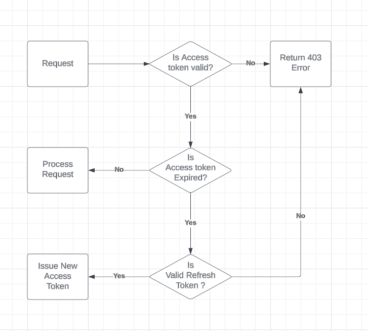

# Build a REST API with Node.js, Mongoose & TypeScript
This is Node Js server with typescript, Rest API using express an middleware and mongoose as ODM with mongoDB and for validation we are zod 

## Technologies

- Node.js
- MongoDB with Mongoose
- TypeScript
- Express.js & Express.js middleware
- Zod validation

## ENV Secrets

| Variable                   | Description                                                                                                |
| -------------------------- | ---------------------------------------------------------------------------------------------------------- |
| `PORT`                     | The port on which the Node server should listen.                                                           |
| `DATABASE_URL`             | MongoDB Database URL (Local or Remote) : NUMBER                                                            |
| `SALTWORKFACTOR`           | number to genereate salt for more secure password. : NUMBER                                                |
| `ACCESSTOKENTTL`           | Access Token Expiry Time. : STRING                                                                         |
| `REFERSHTOKENTTL`          | Refresh Token Expiry Time. : STRING                                                                        |
| `ACCESS_TOKEN_PUBLIC_KEY`  | Public Key. |
| `ACCESS_TOKEN_PRIVATE_KEY` | Private Key. |
| `REFRESH_PUBLIC_KEY`       | Public Key. |
| `REFRESH_PRIVATE_KEY`      | Private Key |

## DATA FLOW 

## Access & refresh token flow
